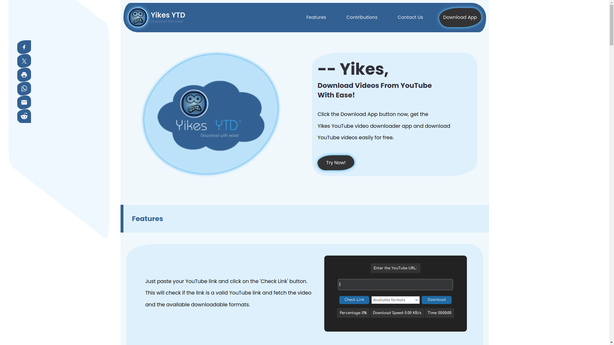

# Yikes YTD Website

Welcome to the Yikes YTD website repository! This repository contains the source code for the Yikes YTD website, where users can learn more about the Yikes YTD application and download it.

The link to the site is https://winterjackson.github.io/site-yikes-ytd/index.html

## About Yikes YTD

Yikes YTD is a free YouTube video downloader application that allows users to download videos from YouTube for offline viewing. With Yikes YTD, users can easily save their favorite videos, tutorials, music, and more to their devices.

## Features

- Paste YouTube links and download videos effortlessly.
- View download progress and details such as percentage, speed, and estimated time.
- Download single videos or entire playlists with ease.

## Getting Started

To get started with Yikes YTD, simply visit our website and download the application. No account creation or login is required.

## Contributing

Contributions to the Yikes YTD project are welcome! If you're a developer or software engineer interested in contributing new features or fixing bugs, feel free to fork this repository and submit pull requests. Please review our Contribution Guidelines on the website before making any contributions.

## Contact Us

If you have any questions, feedback, or concerns about the Yikes YTD website or application, please don't hesitate to contact me at [winterjacksonwj@gmail.com](mailto:winterjacksonwj@gmail.com).

## License

This project is licensed under the [MIT License](LICENSE).

## Credits

This website was created by [Winter Jackson](https://github.com/WinterJackson).
